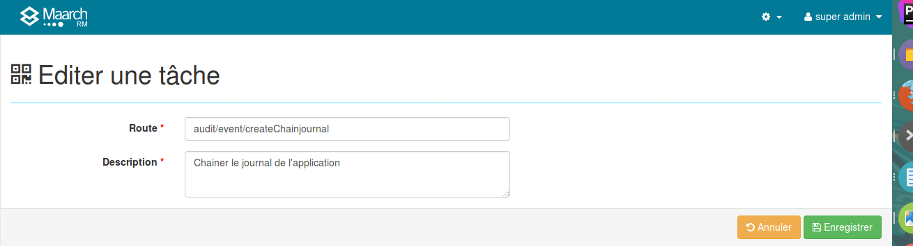

Gestion de la planification
===========================

L'opérateur du système d'archivage configure la planification de l'application dans le module d'administration de l'interface homme-machine et exécute les tâches plannifiées par appel à un unique service. 

## Configuration des tâches
L'opérateur accède au panneau d'administration des tâches planifiables dans le menu **Gestion du planificateur > Tâches**.

Chaque tâche est définie par l'information suivante :

**La route** est l'identifiant du service executable dans l'API de l'application. 
Cette route est constituée du nom du paquet métier, du nom de l'interface et du nom du service. 
Par exemple, pour le service de chaînage du journal du cycle de vie de l'archive, 
on identifie le paquet "lifeCycle", puis l'interface "journal" et enfin le service de création d'un journal chaîné :

    lifeCycle/journal/createChainjournal

**La description** est l'intitulé qui est affiché à l'utilisateur dans les fonctions de gestion du planificateur 
et dans les traces de l'exécution.

## Tâches de base
Les tâches livrées de base et habituellement planifiées sont détaillées ci-après.

### Chaînage du journal de l'application
Ce service réalise une extraction des événements du journal de l'application survenus depuis la dernière exécution, constitue un fichier de journal chaîné avec le précédent, le scelle optionnellement par un horodatage auprès d'un tiers de confiance et le verse dans l'archive.

  * Route : <code>audit/event/createChainjournal</code>
  * Paramètres : néant
  * Origine : Maarch RM

### Chaînage du journal du cycle de vie
Ce service réalise une extraction des événements du journal du cycle de vie de l'archive survenus depuis la dernière exécution, 
constitue un fichier de journal chaîné avec le précédent, le scelle optionnellement par un horodatage 
auprès d'un tiers de confiance et le verse dans l'archive.

  * Route : <code>lifeCycle/journal/createChainjournal</code>
  * Paramètres : néant
  * Origine : Maarch RM

### Contrôle d'intégrité périodique
Ce service prend en compte les niveaux de service applicables aux données d'archives pour sélectionner les populations devant faire l'objet d'un contrôle d'intégrité, réalise le contrôle et émet une alerte fatale en cas d'erreur.

  * Route : <code>recordsManagement/archiveCompliance/readPeriodic</code>
  * Paramètres : néant
  * Origine : Maarch RM

### Envoi des notifications
Ce service prend en compte les notifications enregistrées par les différents modules fonctionnels et techniques, utilise le service de notification (voir Configuration des notifications) pour envoyer les courriels aux administrateurs et utilisateurs.

  * Route : <code>batchProcessing/notification/updateProcess</code>
  * Paramètres : néant
  * Origine : Maarch RM

### Traitement des demandes de communication
Ce service prend en compte les demandes de communication acceptées, constitue un message de réponse à la communication incluant les données et métadonnées d'archive demandées et stocke le paquet compressé dans l'espace d'échange.

  * Route : <code>medona/ArchiveDelivery/updateProcessBatch</code>
  * Paramètres : néant
  * Origine : Extension Third Party Archiving

### Traitement des éliminations
Ce service prend en compte les demandes d'élimination acceptées, détruit les données et optionnellement les métadonnées correspondantes, constitue un message de notification d'élimination à destination du producteur.

  * Route : <code>medona/ArchiveDestruction/updateProcessAll</code>
  * Paramètres : néant
  * Origine : Extension Third Party Archiving

### Traitement des demandes de restitution
Ce service prend en compte les demandes de restitution acceptées, constitue un message de restitution incluant les données et métadonnées d'archive demandées et stocke le paquet compressé dans l'espace d'échange.

  * Route : <code>medona/ArchiveRestitution/updateProcessBatch</code>
  * Paramètres : néant
  * Origine : Extension Third Party Archiving

### Traitement des transferts
Ce service prend en compte les transferts d'archive acceptés, procède au dépôt des données et à l'enregistrement des métadonnées, constitue un message de réponse incluant les données et métadonnées d'archive versées.

  * Route : <code>medona/ArchiveTransfer/updateProcessBatch</code>
  * Paramètres : néant
  * Origine : Extension Third Party Archiving

### Validation des transferts
Ce service prend en compte les transferts d'archive reçus, procède à la validation des données et des métadonnées, dans le cas d'une non conformité constitue un message de réponse incluant les données et métadonnées d'archive rejetées, dans le cas d'une conformité place le bordereau dans le statut "accepté" ou "valide" selon le paramétrage du circuit.

  * Route : <code>medona/ArchiveTransfer/updateValidateBatch</code>
  * Paramètres : néant
  * Origine : Extension Third Party Archiving

### Purge de l'espace d'échange
Ce service prend en compte les messages d'échange correspondant aux règles de sélection définies dans la configuration (voir Gestion de l'espace d'échange) et détruit les données de l'espace d'échange devenues obsolètes.

  * Route : <code>medona/message/DeleteMessageDirectoryPurge</code>
  * Paramètres : néant
  * Origine : Extension Third Party Archiving

## Exécution des tâches planifiées

### Avec le module de planification
L'administrateur fonctionnel planifie l'exécution de ces tâches dans le panneau d'administration, 
en définissant la fréquence et les paramètres de lancement. 
A partir de ce panneau, il peut exécuter les tâches à la demande. 

L'opérateur du système d'archivage DOIT planifier dans le système hôte une seule tâche "maîtresse" 
qui va tenir compte de la planification des tâches dans l'application et les exécuter automatiquement.

La tâche à planifier est la suivante :

  * Route : <code>batchProcessing/scheduling/updateProcess</code>
  * Paramètres : Néant
  * Origine : Maarch RM
  * URI HTTP : PUT batchProcessing/scheduling/process

Pour l'appel en mode ligne de commande, se reporter à la documentation "Publication ligne de commande". 
Un exemple est fourni dans le script shell Linux <code>data/maarchRM/batch/scheduling.sh</code>

### Avec le planificateur du système hôte
L'opérateur du système d'archivage DOIT alors paramétrer le planificateur de son choix pour exécuter les différentes tâches 
planifiées, en définissant la fréquence et les paramètres de lancement dans l'exécution.

Chaque tâche exécute un script shell Linux pour chaque tâche telle que décrite ci-avant.
Pour l'appel en mode ligne de commande, se reporter à la documentation "Publication ligne de commande". 
Un exemple est fourni dans le script shell Linux <code>data/maarchRM/batch/chainJournal.sh</code>
