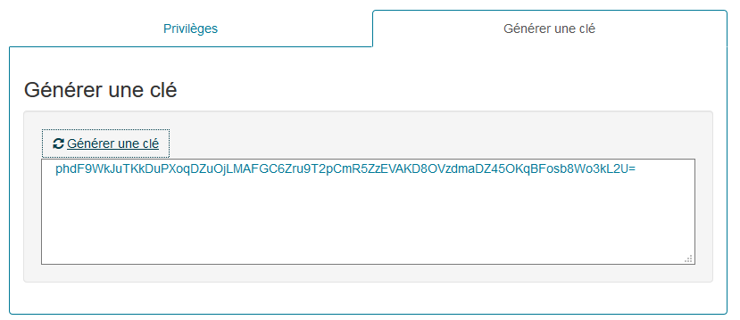

Gestion des comptes de service
===============================
Les comptes de service sont utilisés pour authentifier les clients de service qui accèdent 
aux fonctionnalités au travers d'appels Http REST et ligne de commande. 
Comme un utilisateur, un compte de service est identifié, il est positionné dans l'organisation 
et possède des privilèges pour accéder aux fonctionnalités.

## Administrer les comptes de service
L'administrateur fonctionnel accède à la gestion des comptes de service 
par le menu d'administration **Securité > Comptes de service**.

Un compte de service comporte l'information suivante :

**Un nom de compte** est utilisé pour identifier le logiciel tiers ou la fonction pour laquelle est utilisé le compte.

**Le service d'appartenance** positionne le compte dans l'organisation. 
Le compte de service, à l'inverse du compte utilisateur, ne peut appartenir qu'à un seul service, 
qui est facultatif lorsque le compte n'a besoin d'effectuer que des opérations techniques ou en tous cas 
qui ne nécessitent pas de calcul de ses droits d'accès aux données.
A partir de cet écran, l'administrateur peut générer à partir de l'IHM un jeton de sécurité qui sera 
utilisé par le ou les logiciels tiers clients de l'application afin de s'authentifier.

**Un statut** qui peut être activé ou désactivé pour empêcher temporairement ou de façon permanente 
son utilisation.

Enfin, le compte de service possède **des privilèges** qui sont les identifiants de services de l'API auxquels 
il peut accéder. 

## Générer un jeton d'authentification
Dans le panneau de détail du compte de service, l'opérateur génère le jeton d'authentification 
qui sera utilisé pour les appels aux services en interface Http et ligne de commande. 

> Pour un appel Http, on prendra le soin d'encoder le jeton en URL afin d'éviter que les caractères 
> non alphanumériques ne soient transformés.
