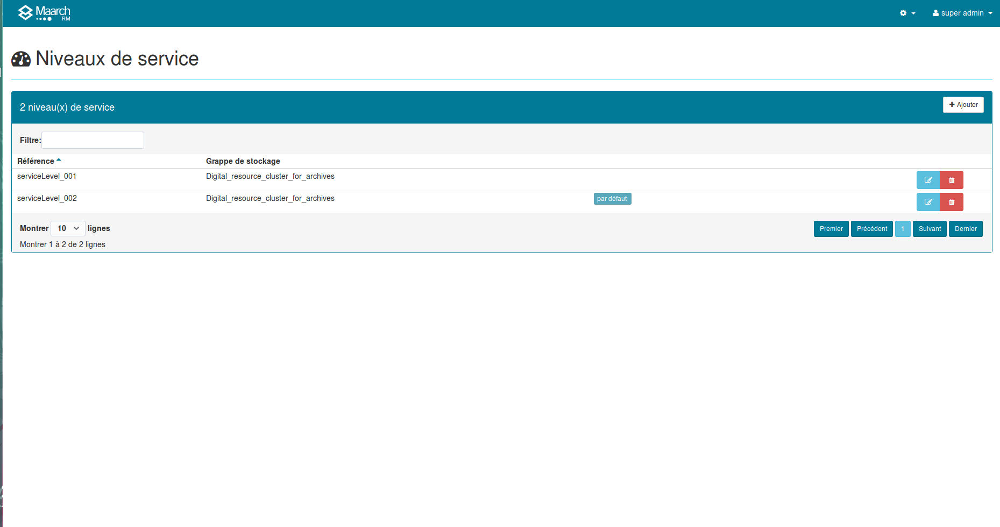
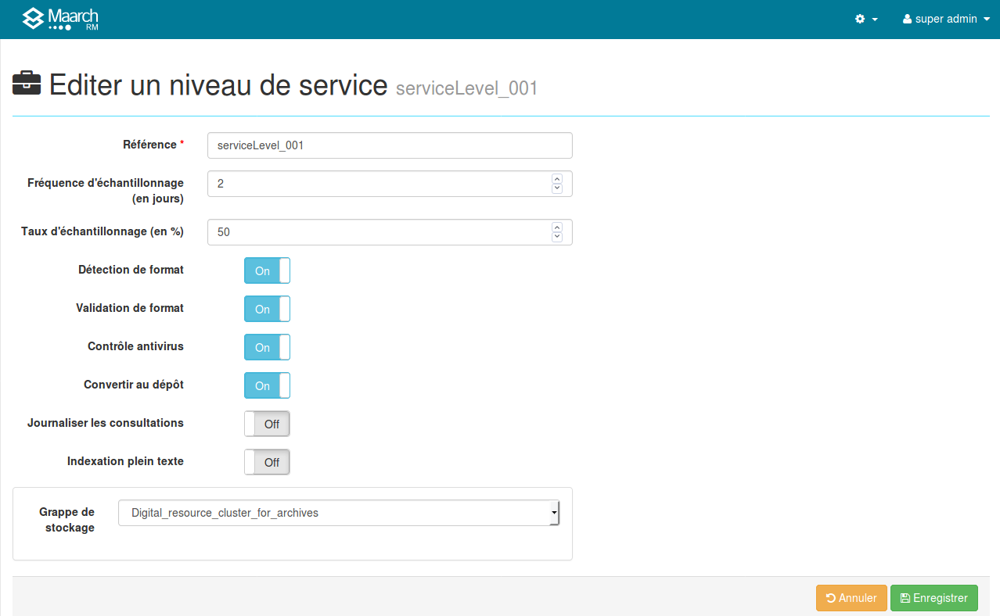

Gestion des niveaux de service
==============================

Le niveau de service est le paramétrage des opérations techniques qui sont réalisées pour 
un ensemble cohérent d'archives au moment du dépôt et au cours de leur conservation.

Il met en application les règles et utilise les référentiels définis précédemment.

Il est précisé de trois manières, chacune annulant et remplaçant la précédente :
  
  1.  dans l'accord de versement utilisé pour un ensemble de versements, 
  dans le cadre d'un archivage mutualisé ou opéré par un tiers,
  2.  dans le bordereau d'échange, spécifiquement pour ce bordereau
  3.  dans les métadonnées de l'archive versée, spécifiquement pour cette archive

L'administrateur accède à la liste des niveaux de service par le menu 
**Gestion de l'archive > Niveaux de service**. 

Un bouton en haut à droite <code>+ Nouveau</code> permet d'afficher le formulaire de saisie des 
informations d'un nouveau niveau de service.

Dans la liste des niveaux existants, des boutons en fin de ligne à droite permettent d'afficher 
le formulaire de modification des informations du niveau ou de supprimer celui-ci.

## Niveau de service par défaut
L'un des niveaux de service de la liste est défini comme niveau par défaut. 
Lorsque l'information de niveau de service est omise dans les données de gestion transmises au versement, 
ce niveau sera utilisé par défaut. 
Pour changer le niveau par défaut, il faut cliquer sur le bouton <code>Defaut</code> qui apparaît dans la 
colonne lorsque le curseur de souris est placée sur la ligne souhaitée.

## Détail d'un niveau de service

Le niveau de service possède les propriétés suivantes :

**Une référence** : il s'agit d'un nom unique qui sera utilisé 
pour identifier le niveau dans les écrans et métadonnées des archives

**Des indicateurs de fonction** : ce sont les options de contrôle des archives lors du versement, 
définis plus bas.

**Une grappe de stockage**: La grappe sera utilisée lors du dépôt des archives lorsque le niveau de service est requis.

> Pour de plus amples informations sur le stockage, reportez-vous à la documentation dédiée à la [gestion du stockage](Gestion_du_stockage.md)

## Services

### Détection de format 
Déclenche le processus d'identification du format, afin de déterminer l'identifiant PRONOM du format de contenu utilisé. Si cette option est désactivée, l'information de format devra être transmise ans le bordereau, faute de quoi aucune information ne sera rattachée au document d'archive, ce qui rend impossible l'établissement des règles de conversion. 

###Validation de format
Déclenche le processus de validation du format, afin de valider le respect des spécifications du format prétendu être utilisé. Si cette option est désactivée, le document sera considéré comme valide. 

### Contrôle antivirus
Déclenche le processus de contrôle antivirus sur les contenus. Attention, ce contrôle est consommateur de ressources et peut s'évérer assez long. Il est recommandé de placer le sas d'échange sous contrôle permanent par un logiciel tiers. 

### Conversion de format
Déclenche le processus de conversion du format, lorsque ces dernières sont transmises dans un format non pérenne qui fait l'objet d'une règle de conversion active.

### Extraction des métadonnées
Déclenche le processus d'extraction des métadonnées et de caractérisation du contenu (documents bureautiques, PDF, balisés, média, image), pour l'indexation automatique. 

### Extraction du texte
Déclenche le processus d'extraction du texte des contenus (documents bureautiques, PDF, balisés, média avec piste texte, images TIFF), pour l'indexation plein-texte. 
