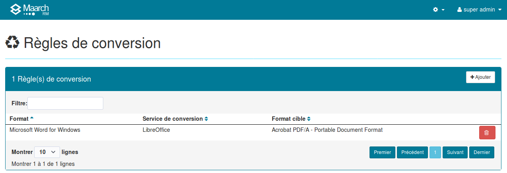
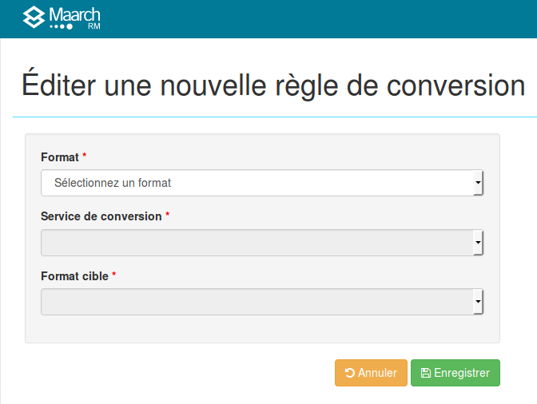

Gestion des règles de conversion
=================================

La pérennisation des contenus d'information conservés dans le système d'archivage pour toute la durée du cycle de vie 
peut nécessiter des conversion des documents, pour aller de formats devenus non pérennes vers de nouveaux formats pérennes.

L'administrateur du système d'archivage définit les règles qui seront disponibles pour réaliser 
les conversions de formats dans le cadre de la planification de la préservation, par le menu
d'administration **Format > Règles de conversion**.

> La mise en oeuvre des règles de conversion nécessite que l'opérateur du système mette à disposition 
les outils de conversion utilisables. Pour de plus amples informations, se reporter à la documentation
dédiée à la [configuration des services de conversion](Configuration_des_services_de_conversion.md)

Chaque règle déclarée possède les propriétés suivantes :

**Format en entrée** : Format des fichiers à convertir, parmi ceux qui sont acceptés en entrée par au moins un service 
de conversion déclaré par l'opérateur.

**Service de conversion**: Service de conversion déclaré par l'opérateur, 
parmi ceux qui acceptent le format en entrée.

**Format en sortie** : Format des fichiers convertis, 
parmi ceux qui peuvent être produits par le service de conversion sélectionné.

