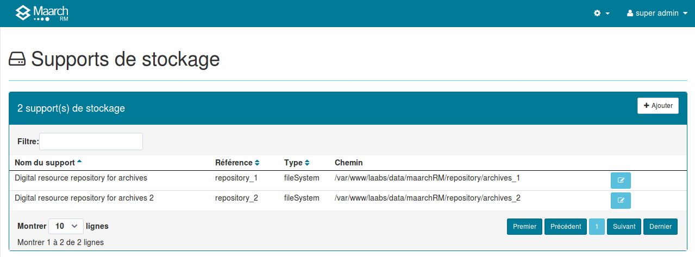
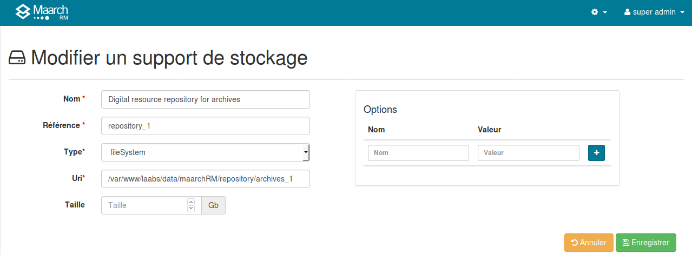
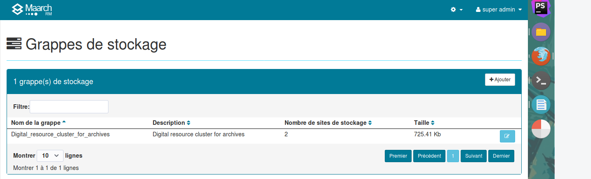

Gestion du stockage
===================
Le stockage est la fonction du système d'archivage qui met en œuvre les mécanismes propres à assurer 
la persistance de l'information numérique, parmi lesquels les opérations d'écriture, 
de lecture et de suppression des contenus binaires sur les supports. 

L'opérateur du système d'archivage assure le stockage sécurisé et pérenne de l'information sur des supports
qui répondent aux exigences de la conservation. 
Pour ce faire, il administre le stockage grâce aux panneaux d'administration de l'interface homme-machine, 
accessibles dans le menu **Gestion du stockage**.

Le stockage est réalisé sur des **supports de stockage** regroupés en **grappes de stockage** pour assurer 
la gestion des copies de sécurité requises pour la conformité aux exigences normatives et réglementaires.

## Supports de stockage
Les supports de stockage sont les dispositifs techniques qui assurent la persistance des contenus 
d'information binaires. Il existe de nombreux types de support pour les documents numériques :

  * systèmes de fichiers réinscriptibles tels que des disques durs, locaux ou en réseau (HDD, NAS/SAN)
  * supports WORM (Write Once Read Many) tels que disques optiques numériques, CD-R, CD-WORM, DVD-D
  * services de stockage dans le nuage
  * base de données (stockage BLOB)
  * etc.

Maarch RM est livré en standard un connecteur pour les systèmes de fichiers réinscriptibles `fileSystem`, 
et propose une interface de programmation pour le branchement d'autres technologies.
 
L'administrateur accède à la liste des supports de stockage par le menu 
**Gestion du stockage > Supports de stockage**.

Ce panneau d'administration permet de déclarer les supports de stockage des documents numériques utilisant 
une technologie de stockage parmi celles implémentées.

Le bouton `+ Nouveau` en haut à droite de la liste permet d'afficher le formulaire de saisie 
des informations d'un nouveau support de stockage. 
A droite de chacune des lignes représentant un support de stockage existant, 
un bouton permet d'afficher le formulaire de modification des informations du support.

Un support de stockage possède les caractéristiques suivantes :

**Identifiant** : Identifier le support dans les fonctions

**Nom** : Décrit et identifie le support dans les écrans

**Type** : Définit la technologie utilisée par le service de stockage

**Chemin** : Chaîne de caractères (URI) qui permet d'accéder au support. Pour un système de fichiers, 
c'est le chemin vers la racine de l'arborescence de stockage à partir du système d'archivage. 
Pour un serveur en ligne, il pourrait s'agir de l'URL, pour une base de données, de la chaîne de connexion.

**Paramètres** : Le service de stockage peut nécessiter ou accepter des option ou paramètres supplémentaires pour son utilisation. 
Par exemple, le système de fichiers réinscriptible accepte un masque de chemin répertoire contenant des variables pour déterminer dynamiquement le nom des sous-répertoire de stockage des documents déposés, un système en ligne demandera un nom d'utilisateur et un mot de passe, etc.
Ces paramètres sont configurables dans l'écran, sous la forme d'une liste de couples clé-valeur. 
Il faut saisir un nom et une valeur pour l'option, puis utiliser le bouton + à droite pour ajouter à la liste. 
Pour les options déjà configurées, un bouton représentant une poubelle permet de supprimer l'option.
Le nombre et la nature de ces options est spécifique au service de stockage utilisé, il faut donc se référer 
à la documentation de ce dernier pour connaître les possibilités de configuration à l'exécution supplémentaires utilisables.

## Grappes de stockage
Le système d'archivage électronique n'accède pas directement aux services de stockage pour les opérations 
d'écriture et de lecture. Il utilise des structures logiques nommées des grappes de stockage (clusters) 
qui regroupent un ou plusieurs supports utilisés pour la pérennisation des contenus et gèrent des copies 
de ces derniers.

L'administrateur accède à la liste des grappes de stockage par le menu 
**Gestion du stockage > Grappes de stockage**.

Le bouton `+ Nouveau` en haut à droite de la liste permet d'afficher le formulaire de saisie 
des informations d'une nouvelle grappe de stockage.
A droite de chacune des lignes représentant une grappe de stockage existante, 
un bouton permet d'afficher le formulaire de modification des informations de la grappe.

Une grappe de stockage possède les caractéristiques suivantes :

**Identifiant**:Identifier la grappe dans les fonctions

**Nom**:Décrit et identifie la grappe dans les écrans

**Supports de stockage**: Ce sont les supports utilisés lorsque le système accède à la grappe pour 
es opérations d'écriture, de lecture et de suppression, et précise la priorité d'accès entre les supports 
de la grappe pour chacune de ces opérations.
Pour ajouter un support de stockage à la grappe, choisir un support existant dans la liste proposée. 
Chaque support ne peut être utilisé qu'une seule fois par grappe; 
définir ensuite la priorité pour chacune des opérations, 1 étant la priorité la plus élevée, puis 2, 3, etc,
 puis utiliser le bouton `+ Ajouter`.

La liste des supports déjà utilisés à droite de l'écran permet de connaître leur nom et les priorités définies. 
Un bouton représentant un poubelle permet de supprimer le rattachement du support. 
La suppression du rattachement n'entraîne pas la suppression du support dans la liste des supports disponibles.

La **priorité en lecture** permet de définir dans quel ordre le système d'archivage accèdera aux supports 
de la grappe pour lire les contenus numériques. 
Le support de priorité la plus haute, donc d'ordre le plus bas, est accédé en premier. 
Si deux supports ont été définis avec la même priorité, l'un ou l'autre seront accédés aléatoirement 
pour répartir la charge.
Si la ressource est trouvée et conforme sur le support, elle est renvoyée à l'utilisateur.
Dans le cas contraire, le système émettra une alerte dans le journal du cycle de vie de 
l'archive et poursuivra sa tentative lecture sur le support de stockage de priorité en lecture
immédiatement supérieure (ou égale), et ainsi de suite jusqu'à ce qu'il n'y ait plus de support disponible.
Si tous les supports ont été accédé sans retrouver l'archive, une exception est levée et l'utilisateur 
sera informé de l'impossibilité de lui délivrer le contenu.

La **priorité en écriture** permet de définir dans quel ordre le système d'archivage accédera 
aux supports de la grappe pour écrire les contenus numériques.
Le support de priorité la plus faible est utilisé en premier. 
Si deux supports ont été définis avec la même priorité, l'écriture aura lieu simultanément sur les deux.
Ce mécanisme permet de réaliser une copie de sécurité sur un support distant dès le versement des documents
archivés. Les supports de priorité d'écriture plus basse pourront être utilisé lors d'écritures ultérieures, 
par appel à un processus d'arrière plan de recopie.

La **priorité en suppression** permet de définir dans quel ordre le système d'archivage accédera aux supports
de la grappe pour détruire les contenus numériques.
Dans le cas d'une élimination d'archive, elle s’opère sur l'ensemble des copies et ne tient pas compte de cette valeur. 
Un processus asynchrone permet, dans le cadre de migrations de support, de réaliser une suppression sur le support 
de priorité la plus haute (ordre le plus bas) après une écriture sur des supports secondaires par exemple.
