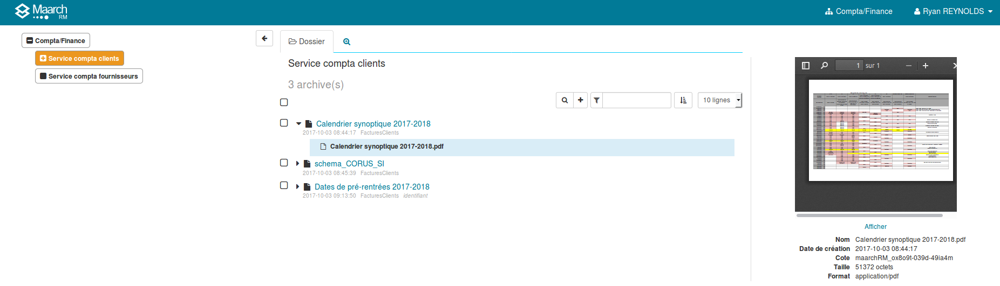
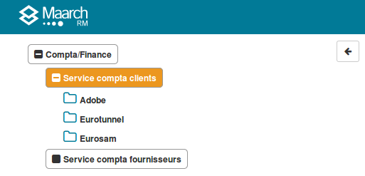

Interrogation du système
========================

L'interrogation regroupe l'ensemble des fonctions qui permettent à l'utilisateur 
de naviguer dans l'archive, de rechercher l'information et d'y accéder.

L'écran d'accueil est composé de trois zones :

  * à gauche, la navigation dans le plan de classement,
  * au centre, le contenu des dossiers et la recherche,
  * à droite, le détail des éléments sélectionnés.

## Navigation dans le plan de classement 

La partie à gauche de l'écran permet à l'utilisateur de naviguer dans le plan de classement 
de l'archive. Le plan a deux origines :

  * le plan de classement archivistique, défini par l'administrateur du système et 
  * les dossiers virtuels des services, gérés par les utilisateurs du métier à l'intérieur 
  de leurs services. 

### Plan de classement de l'organisation
Les niveaux de classement représentés vont des unités orgaisationnelles les plus 
générales, les grandes directions aux activités productrices de documents d'archive
les plus précises souhaités, en passant par les services, bureaux, équipes, etc.

> Pour simplifier, tous les niveaux d'organisation sont qualifiés de "services" 
dans la présente documentation.

L'appartenance d'un utilisateur à un service lui ouvre automatiquement l'accès aux 
données d'archive produites par ce dernier, ainsi qu'à celles produites par tout 
service dépendant (plus bas dans la hiérarchie du plan).

L'utilisateur retrouve donc dans son arborescence son service d'appartenance,
ainsi que les services dépendants et activités associées définis dans le plan de 
classement de l'organisation, sous la forme du nom du service dans un cartouche blanc.

Chaque niveau dans le plan de classement de l'organisation contient l'ensemble des 
unités d'archives produites par le service (ou la direction, ou l'activité...).

Le contenu des dossiers est affiché dans la zone centrale de l'écran en cliquant 
sur le cartouche du service.

> Le contenu affiché à l'utilisateur correspond aux unités d'archives qui n'ont pas 
été classées dans des dossiers virtuels.

### Dossiers virtuels des services 
En plus du plan de classement de l'organisation, chaque service peut organiser son 
sous-fonds d'archive pour répondre aux besoins de son métier grâce à des dossiers 
virtuels.

Le terme "virtuel" est utilisé pour signifier que l'arborescence et son contenu 
n'impactent en aucun cas le plan de classement archivistique. 

Par exemple, lorsqu'un dossier virtuel est supprimé, les archives qui y
étaient placées ne sont pas détruites, l'utilisateur du service les retrouve simplement
à la racine de son service producteur. 

> Seul un utilisateur habilité peut ajouter, modifier et supprimer des dossier virtuels.
Voir la documentation dédiée à la [Gestion des dossiers virtuels](Gestion_des_dossiers_virtuels.md) 

> Seul un utilisateur habilité peut classer les unités d'archive dans des dossiers virtuels.
Voir la documentation dédiée au [Classement dans les dossiers virtuels](Classement_dans_les_dossiers_virtuels.md) 

Chaque dossier du classement virtuel contient un ensemble d'unités d'archives classées 
par le service.

Une **icône de dossier vide** indique un dossier qui ne contient pas de sous-dossiers. 

Une **icône de dossier pleine** indique un dossier qui contient des sous-dossiers, qui sont 
accessibles en cliquant sur l'icône. 

Le contenu des dossiers virtuel est affiché dans la zone centrale de l'écran en cliquant 
sur le **nom du dossier**.

## Contenu des dossiers 

Au centre de l'écran s'affiche la liste des unités d'archives contenues dans le dossier 
sélectionné dans le navigateur, qu'il s'agisse de dossiers du plan de classement de 
l'organisation (directions, services, activités) ou des dossiers virtuels du service. 

Il s'agit d'une liste triée, paginée et filtrable qui affiche pour chaque unité d'archive 

  * **une icône de dossier ou de fichier** pour indiquer sa nature "dossier" ou "pièce",
  * **son intitulé**, 
  * **ses informations de base** : profil documentaire, date de dépôt, date de production 
  et identifiant métier éventuellements renseignés

Le détail de l'information de l'unité d'archive est affiché dans la zone de détail à droite 
en cliquant sur son intitulé.

### Contenu de l'unité d'archive 

L'unité d'archive est un conteneur pour l'information numérique conservée dans le système 
d'archivage. Elle peut contenir des documents numériques et d'autres unités d'archive 
selon sa nature :

  * **un dossier** contient une ou plusieurs unités d'archives et **_peut_** contenir 
  un ou plusieurs documents numériques, 
  * **une pièce** contient un ou plusieurs documents numériques mais **_ne peut pas_**
  contenir d'unité d'archive.

Le signe d'insertion (caret, petit triangle noir) à gauche de l'icône et de l'intitulé 
de l'unité d'archive permet d'ouvrir le conteneur pour afficher la structure des contenus.

Il s'agit d'une liste qui montre le sunités d'archives contenues s'il y en a, puis les 
documents numériques, dans l'ordre de leur versement dans le système.

Les unités d'archives contenues sont affichées comme leur unité racine. 

###  Documents numériques de l'unité d'archive
La partie de liste de contenu d'unité d'archive affiche pour chaque document numérique:

  * **une icône de fichier**,
  * **le nom du document numérique**, qui correspond habituellement au nom de fichier.

Le détail de l'information du document numérique est affiché  dans la zone de détail à droite 
en cliquant sur son intitulé.

## Détail des contenus 

A droite de l'écran, le panneau de détail affiche les informations relatives au contenu 
sélectionné dans la zone centrale, unité d'archive ou document numérique.

### Détail d'une unité d'archive 

Le détail d'une unité d'archive est affiché en cliquant sur son intitulé dans le panneau central.

Il affiche les métadonnées descriptives et de gestion.

Les métadonnées descriptives sont :

  * l'identifiant du document pour le producteur : numéro de document, référence...
  * l'intitulé,
  * la date de production, 
  * le profil documentaire (typologie de dossier ou de pièce),
  * un jeu de métadonnées liées au profil et/ou ajoutées par l'utilisateur.

Les métadonnées de gestion sont 

  * le service producteur,
  * la date de versement,
  * la règle de conservation (durée, sort final, date d'échéance),
  * la cote (l'identifiant unique de l'unité dans le système d'archivage),
  * le statut (dans le cycle de vie de l'archive).

### Détail d'un document numérique 

Le détail d'un document numérique est affiché en cliquant sur son intitulé dans le panneau central.

Il affiche les métadonnées technique et un accès aux contenu numérique.

Les métadonnées technique sont :
 
  * le nom du fichier,
  * la cote (l'identifiant unique du document dans le système d'archivage),
  * la date de création dans le système,
  * la taille du contenu,
  * le format identifié par l etype MIME ou l'identifiant PRONOM

Le contenu numérique est accessible en deux points :

  * une prévisualisation peut être activée pour certains formats, 
  en fonction de la configuration du système et des capacités du navigateur 
  (PDF, image, audi, video, multimedia)
  * un lien `Afficher` ouvre une nouvelle page pour télécharger 
  ou afficher le contenu numérique en fonction des capacités du navigateur 

